                                             Polytech OS User – TP partie 1

III - Le sujet

Création du programme biceps : Bel Interpréteur de Commandes des Elèves de Polytech Sorbonne.
L’objectif de ces premières étapes est de vous guider pour créer un outil beaucoup plus pratique que
le triceps : Très Rudimentaire Interpréteur de Commandes des Elèves de Polytech Sorbonne.

1 – Etape 1 : Création du programme interactif

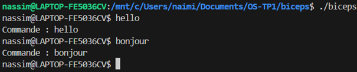

2 – Etape 2 : Analyse de la commande

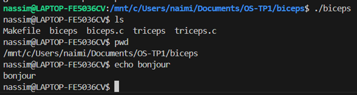

3 – Etape 3 : Exécution des commandes

    3.1 Mise en place des commandes internes

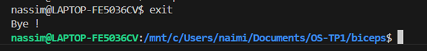

    3.2 Gestion des commandes externes

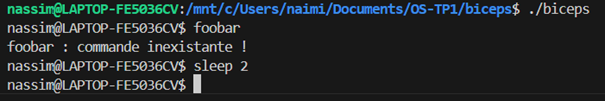

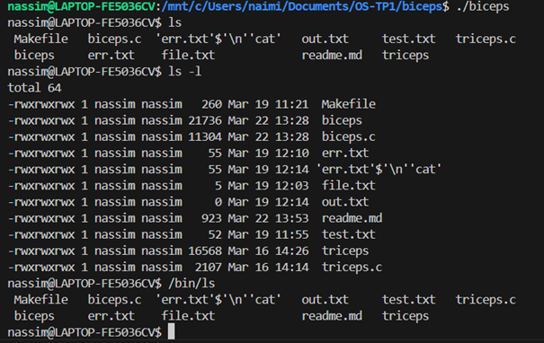

4 – Etape 4 : biceps version 1

    4.1 Des commandes internes indispensables

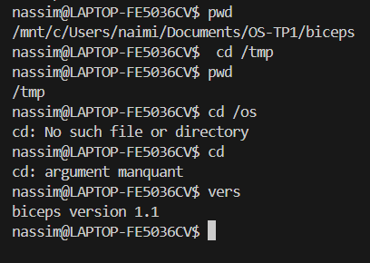

    4.2 Des commandes externes séquentielles

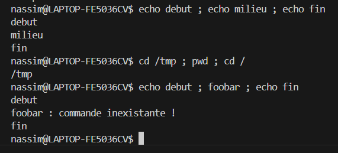

    4.3 Amélioration de l’utilisation de biceps

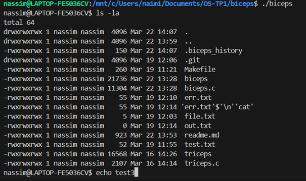

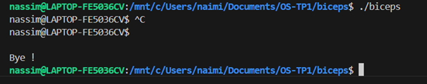

    4.4 Restructuration du code

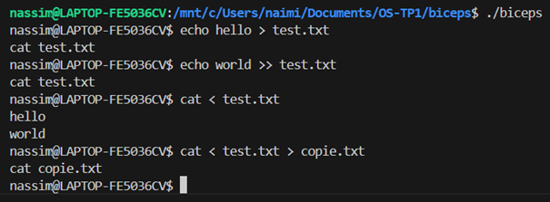

5 – Etape 5 : biceps version 1.x

    5.1 – version 1.1 : gérer les pipes ( | )

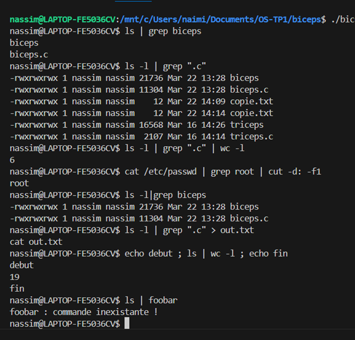
